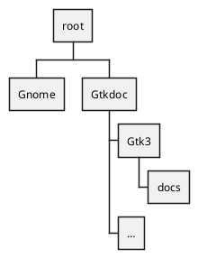
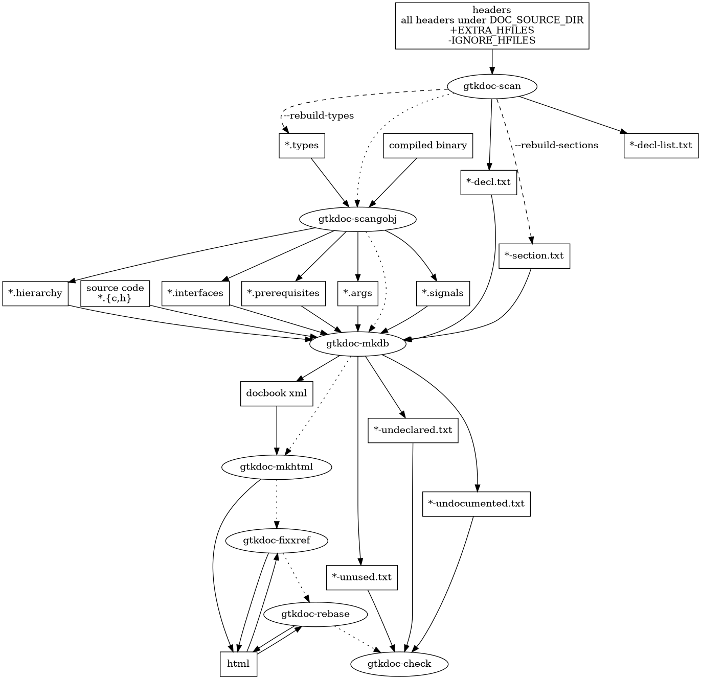
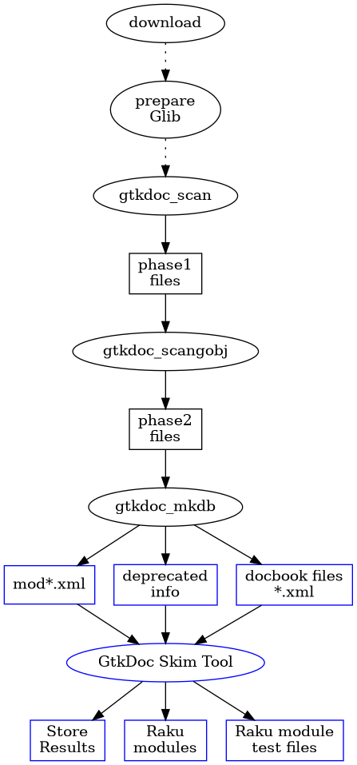

# Gnome source code skimmer

## Purpose

The purpose is to get the information out of the source code (`.h` and `.c` files) of packages of Gnome like Glib, (with Gio, GObject), Pango and Cairo (for which Gnome has bindings to), Gtk and Gdk (versions 3 and 4) Atk and a few others.

I have done that myself in the past using a single program and generate Raku modules from the retrieved information. The program is getting a bit awkward to maintain it, because of writing differences found in the code.

Now I've come across a package of Gnome called `GtkDoc`. It is a bit of a beast to get that working. Gnome apologises for that, that it was intended to be used internally only to get their documentation in a neat display.

In this GtkDoc package there are programs which read those source files and generate files in all sorts of formats. The modules and programs in this Raku package can read the generated files (of which we only need a few of them) and generate the Raku modules which can then access the gnome libraries. The Raku modules come with documentation and a test template for initialization, method calls, signal handling and property testing. Markdown or HTML can be generated from the documentation using Raku pod rendering programs.

The generated Raku modules would have some work afterwards to remove problems which can not be handled by the modules of this Raku package.


## Description

This is a description of how to prepare the GtkDoc and Gnome libraries before we are able to get all the information we need.

### Preparations

There are only 3 programs needed. One of them creates a C-program and must be compiled and linked against external libraries. On this computer I have choosen to just compile them but not to install them to prevent any inconsistencies with other programs in the system. So it is important to download the sources of the same versions as those of your libraries.

#### Directory structure
The root of it all is at `$*HOME/.config/io.github.martimm.source-skim-tool`. The directory where Gnome sources are downloaded and unpacked is `Gnome` in this root. The generated files from GtkDoc go to the `GtkDoc` directory.
The files are prefixed with text given to the `--module` option of the programs.
The `Gtkdoc/Gtk3` is also provided to an option. In this case to get info from the Gtk version 3 sources.



#### Compiling Glib, Gio and GGbject libs

To compile a generated program right, we must do some extra work. See also [Beyond Linux® From Scratch](https://www.linuxfromscratch.org/blfs/view/svn/general/glib2.html).

* Go to the Gnome directory.
* Download glib-2.74.5.tar.xz and a patch glib-2.74.5-skip_warnings-1.patch.
* Then run the following;
  ```
  > tar xvf glib-2.74.5.tar.xz
  > cd glib-2.74.5
  > patch -Np1 -i ../glib-2.74.5-skip_warnings-1.patch
  > mkdir build
  > cd build
  > meson --prefix=/usr --buildtype=release -Dman=true ..
  > ninja
  > setenv LC_ALL C
  > ninja test
  ```

### GtkDoc

The example below shows the commands to get the information from the Gtk version 3 sources.

Go to the Gnome directory and download the Gtk source. in this case for version 3.24.24. Unpack the tar-file and go back to the top directory.
```
> mkdir -p Gtkdoc/Gtk3/docs
> cd Gtkdoc/Gtk3
> gtkdoc-scan --module gtk3 --output-dir . --source-dir ../../Gnome/gtk+-3.24.24/gtk
> gtkdoc-scangobj --module gtk3 --verbose --cflags '\-I../../Gnome/glib-2.74.5/glib -I../../Gnome/glib-2.74.5/gobject -I../../Gnome/glib-2.74.5 -I../../Gnome/glib-2.74.5/build/glib -I../../Gnome/glib-2.74.5/build/' --ldflags '\-L../../Gnome/glib-2.74.5/build/gobject -L../../Gnome/glib-2.74.5/build/glib -L/usr/lib64 -lgobject-2.0 -lglib-2.0 -lgtk-3 -lgobject-2.0 -lglib-2.0 -lgtk-3'
> gtkdoc-mkdb --module gtk3 --source-dir ../../Gnome/gtk+-3.24.24/gtk --output-dir docs --xml-mode
```
However, the compiling and linking of `gtk3-scan.c` has errors. It cannot find all the `*_get_type` references. They seem not to be defined in any of the used dynamic libraries. I found out that the references are all named in the file `Gtkdoc/Gtk3/gtk3.types`. Removing some entries from that file also showed that less linking errors were shown. Therefore we need to filter out those functions from the `gtk3.types` list.

Other errors might be found when compiling for other modules like for example for `Gio`, `Pango`, `Cairo`, etc. This is not yet checked, w'll see what the future will bring.


#### GtkDoc tools diagram

A diagram showing the programs and the generated files.



# The Raku modules

The module **Gnome::SourceSkimTool::Prepare** takes care of the GtkDoc generation steps but not of the Glib preparations. **Gnome::SourceSkimTool::SkimGtkDoc** takes care of reading the GtkDoc files to get the information.

## A diagram

A diagram of the work involved and what the Raku modules do. `Download` means everything coming from elsewhere and unpacking it. `mod*.xml` means the module names from some gnome package, e.g. `gtkbutton.xml`.
<!-- `prefixed` is the prefix text such as `gtk3`.-->



