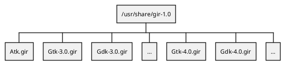
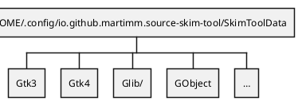
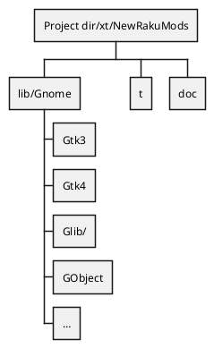

[toc]

# GIR

The description found is `gtkdoc.md` is past time. Now I started to develop generators using so called `.gir` files.

**GIR** stands for _Gnome Introspection Repository_. In fedora there are packagaes to install gir types into the directory at `/usr/share/gir-1.0/`. If the package is not available, these can also [be found at Gnome]().

The `.gir` files are **XML** files holding all information one needs to understand how classes, records, interfaces, methods, functions, handlers and so on are build in Gnome.

# Directory structure

## System Directories

## Local Directories

## Result Directories

# Complete Generate Method
This setup strifes to completely generate all classes, roles, structures and documentation. Many modules are generated which will take a lot of time when installing a package.

The Gir files are XML files and sometimes large and therefore slow to load and to process later. In the complete generation method, the gir files are loaded and split into smaller ones before using them to generate a module.

To speed up things, the gir (XML) files can be translated into YAML.

The end product, a Raku module, its documentation, enumerations, etc. is generated using the data in the data files.

# Partly Generate Method
This method is used to partly generate the necessary modules to hold enumerations, structures and constants. A few modules could still be generated holding some classes so it will be easier to register signals the old way.

These modules reside in Glib and GObject which are small packages and therefore installs more easily. Other packages not needing any changes are the Native and Test modules.

All other packages (especially Gtk3 and Gtk4) would benefit from it becoming small and having less install time. Because the names of the classes would the same, it is imparative to add a `:api('gir')` to make a distinction between the packages. The user needs to import the module as e.g. `use Gnome::Gtk3::Label:api('gir');`. Also possible to make a new root name `Gir::Gtk3::Label`.

## Setup

All supported classes are still in separated modules but the module will be quite empty. Just the unit to establish the hierargy, a BUILD submethod and several hooks to get into the GIR libs. The entrypoint is a FALLBACK method.

When the user of module imports it, Some information is then setup and made ready in that module. This could be done at import time or when BUILD is called.

The native routines and their API are then found via GIR libraries when a native routine is used.

## Test
To test it, I will start with a handmade Window widget to see what must be generated and what can be found out at run time.