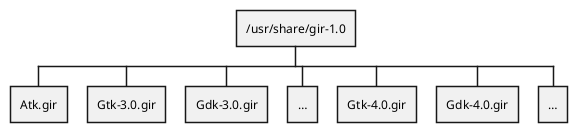
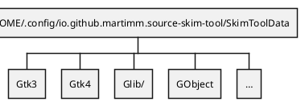
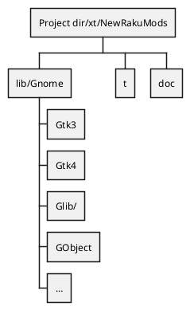

[toc]

# GIR

The description found is `gtkdoc.md` is past time. Now I started to develop generators using so called `.gir` files.

**GIR** stands for _Gnome Introspection Repository_. In fedora there are packagaes to install gir types into the directory at `/usr/share/gir-1.0/`. If the package is not available, these can also [be found at Gnome]().

The `.gir` files are **XML** files holding all information one needs to understand how classes, records, interfaces, methods, functions, handlers and so on are build in Gnome.

# Directory structure

## System Directories

## Local Directories

## Result Directories

