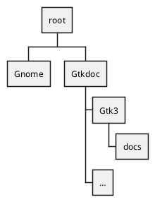

[toc]

# Programs
The programs useful to get the info about functions, documentation, enumerations, etc are in a list below. There are more programs to get a complete documentation but is not needed for the Raku library. To get one of the programs to run, which is generated, some installation steps must be performed.

## The programs
* gtkdoc-scan
* gtkdoc-scangobj. This generates a c-program `*-scan.c`. Its prefix `*` is the `--module` specification. For instance, `--module gtk3` generates a `gtk3-scan.c` program.
* gtkdoc-mkdb


# Make glib, gio and gobject libs
We need to generate libs etc from the glib code to be used with `*-scan.c`.

See also [Beyond Linux® From Scratch](https://www.linuxfromscratch.org/blfs/view/svn/general/glib2.html).

* Download glib-2.74.5.tar.xz and a patch glib-2.74.5-skip_warnings-1.patch.
* Then run the following;
  ```
  > tar xvf glib-2.74.5.tar.xz
  > cd glib-2.74.5
  > patch -Np1 -i ../glib-2.74.5-skip_warnings-1.patch
  > mkdir build
  > cd build
  > meson --prefix=/usr --buildtype=release -Dman=true ..
  > ninja
  > setenv LC_ALL C
  > ninja test
  ```

# Gtkdoc

* Directory structure


* Commands
The gnome sources are stored at the Gnome directory

```
> cd `root`
> mkdir -p Gtkdoc/Gtk3
> cd Gtkdoc/Gtk3
> gtkdoc-scan --module gtk3 --output-dir . --source-dir ../../Gnome/gtk+-3.24.24/gtk
> gtkdoc-scangobj --module gtk3 --verbose --cflags '\-fPIC -I../../Gnome/glib-2.74.5/glib -I../../Gnome/glib-2.74.5/gobject -I../../Gnome/glib-2.74.5 -I../../Gnome/glib-2.74.5/build/glib -I../../Gnome/glib-2.74.5/build/' --ldflags '\-Wl,--no-undefined -Wl,-z,relro -Wl,--as-needed -Wl,-z,now -L../../Gnome/glib-2.74.5/build/gobject -L../../Gnome/glib-2.74.5/build/glib -L/usr/lib64 -lgobject-2.0 -lglib-2.0 -lgtk-3 -lgobject-2.0 -lglib-2.0 -lgtk-3'
> gtkdoc-mkdb --module gtk3 --source-dir ../../Gnome/gtk+-3.24.24/gtk --output-dir docs --xml-mode
```
However, the compiling and linking of `gtk3-scan.c` has errors. It cannot find all the `*_get_type` references. They seem not to be defined in any of the used dynamic libraries. I found out that the references are all named in the file `Gtkdoc/Gtk3/gtk3.types`. Removing some entries from that file also showed that less linking errors were shown. Therefore we need to filter out those functions from the `gtk3.types` list.

Other errors might be found when compiling for other modules like for example for `Gio`, `Pango`, `Cairo`, etc. W'll see.

# Tools diagram
A diagram showing all the generated files by the several gtkdoc programs.

```plantuml
'scale 0.8
digraph gtkdoc {
    /* graph attributes */
    /*rankdir=BT;*/
    
    /* default node attributes */
    node [ shape=box];
    
    /* tools nodes */
    gtkdoc_scan [label="gtkdoc-scan",shape="ellipse" ];
    gtkdoc_scangobj [label="gtkdoc-scangobj",shape="ellipse" ];
    gtkdoc_mkdb [label="gtkdoc-mkdb",shape="ellipse" ];
    gtkdoc_mkhtml [label="gtkdoc-mkhtml",shape="ellipse" ];
    gtkdoc_fixxref [label="gtkdoc-fixxref",shape="ellipse" ];
    gtkdoc_rebase [label="gtkdoc-rebase",shape="ellipse" ];
    gtkdoc_check [label="gtkdoc-check",shape="ellipse" ];

    /* file nodes */
    headers [label="headers\nall headers under DOC_SOURCE_DIR\n+EXTRA_HFILES\n-IGNORE_HFILES"];
    sources [label="source code\nall files under DOC_SOURCE_DIR\nmatching SUFFIXES or *.{c,h}"];
    binary [label="compiled binary"];
    xml [label="docbook xml"];
    html [label="html"];
    module_decl_list [label="*-decl-list.txt" ];
    module_decl [label="*-decl.txt" ];
    module_types [label="*.types" ];
    module_sections [label="*-section.txt" ];
    module_signals [label="*.signals" ];
    module_hierarchy [label="*.hierarchy" ];
    module_interfaces [label="*.interfaces" ];
    module_prerequisites [label="*.prerequisites" ];
    module_args [label="*.args" ];
    module_undeclared [label="*-undeclared.txt" ];
    module_undocumented [label="*-undocumented.txt" ];
    module_unused [label="*-unused.txt" ];
 
    /* tool invocation */
    gtkdoc_scan -> gtkdoc_scangobj -> gtkdoc_mkdb -> gtkdoc_mkhtml -> gtkdoc_fixxref -> gtkdoc_rebase -> gtkdoc_check [style="dotted"];

    /* file usage */
    headers -> gtkdoc_scan;
    gtkdoc_scan -> module_sections [label="--rebuild-sections", style="dashed"];
    gtkdoc_scan -> module_types [label="--rebuild-types", style="dashed"];
    gtkdoc_scan -> module_decl;
    gtkdoc_scan -> module_decl_list;
 
    binary -> gtkdoc_scangobj;
    module_types -> gtkdoc_scangobj;
    gtkdoc_scangobj -> module_signals;
    gtkdoc_scangobj -> module_hierarchy;
    gtkdoc_scangobj -> module_interfaces;
    gtkdoc_scangobj -> module_prerequisites;
    gtkdoc_scangobj -> module_args;

    sources -> gtkdoc_mkdb;
    module_sections -> gtkdoc_mkdb;
    module_decl -> gtkdoc_mkdb;
    module_signals -> gtkdoc_mkdb;
    module_args -> gtkdoc_mkdb;
    module_hierarchy -> gtkdoc_mkdb;
    module_interfaces -> gtkdoc_mkdb;
    module_prerequisites -> gtkdoc_mkdb;
    gtkdoc_mkdb -> xml;
    gtkdoc_mkdb -> module_undeclared;
    gtkdoc_mkdb -> module_undocumented;
    gtkdoc_mkdb -> module_unused;
    
    xml -> gtkdoc_mkhtml -> html;
    
    html -> gtkdoc_fixxref -> html;
    html -> gtkdoc_rebase -> html;
    
    module_undeclared -> gtkdoc_check;
    module_undocumented -> gtkdoc_check;
    module_unused -> gtkdoc_check;
}

```