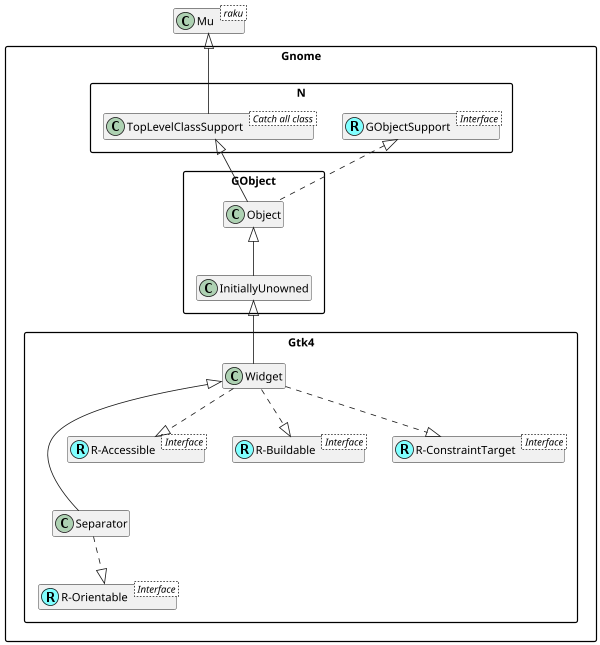

```plantuml
@startuml
scale 0.8

skinparam packageStyle rectangle
skinparam stereotypeCBackgroundColor #80ffff
set namespaceSeparator ::
hide members

class Mu < raku >

class Gnome::N::TopLevelClassSupport < Catch all class >
Mu <|-- Gnome::N::TopLevelClassSupport

Interface Gnome::N::GObjectSupport < Interface >
class Gnome::N::GObjectSupport <<(R,#80ffff)>>

Interface Gnome::Gtk4::R-Orientable < Interface >
class "Gnome::Gtk4::R-Orientable" <<(R,#80ffff)>>
Gnome::Gtk4::Separator ..|> "Gnome::Gtk4::R-Orientable"
Gnome::Gtk4::Widget <|--- Gnome::Gtk4::Separator

Interface Gnome::Gtk4::R-Accessible < Interface >
class "Gnome::Gtk4::R-Accessible" <<(R,#80ffff)>>
Gnome::Gtk4::Widget ..|> "Gnome::Gtk4::R-Accessible"

Interface Gnome::Gtk4::R-Buildable < Interface >
class "Gnome::Gtk4::R-Buildable" <<(R,#80ffff)>>
Gnome::Gtk4::Widget ..|> "Gnome::Gtk4::R-Buildable"

Interface Gnome::Gtk4::R-ConstraintTarget < Interface >
class "Gnome::Gtk4::R-ConstraintTarget" <<(R,#80ffff)>>
Gnome::Gtk4::Widget ..|> "Gnome::Gtk4::R-ConstraintTarget"
Gnome::GObject::InitiallyUnowned <|-- Gnome::Gtk4::Widget

Gnome::GObject::Object <|-- Gnome::GObject::InitiallyUnowned
Gnome::N::TopLevelClassSupport <|-- Gnome::GObject::Object
Gnome::N::GObjectSupport <|. Gnome::GObject::Object

@enduml
```

